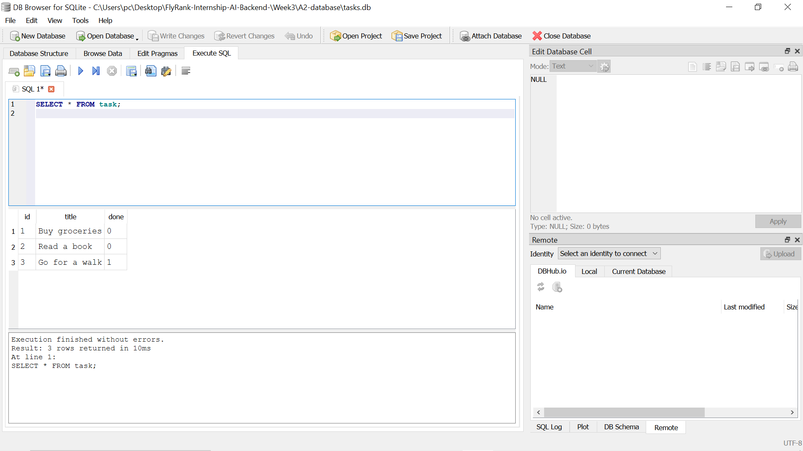

# Week 3 — A2: Connecting CRUD to a Database

## Why SQLite?
SQLite stores all data in a single file (`tasks.db`) with zero setup — no server to install or run. Data survives restarts, making it a real database instead of in-memory storage.

## How to run
```bash
pip install sqlmodel fastapi uvicorn
uvicorn main:app --reload
```

## Database file
`tasks.db` is created automatically on first run. It is git-ignored so each clone starts fresh with 3 seeded tasks.

## Example SQL query (ran in DB Browser)
```sql
SELECT * FROM task WHERE done = 1;
```
Returns all completed tasks. Running this in DB Browser showed "Go for a walk" (id=3, done=1).

## DB Browser screenshot


## Proof storage is just an implementation detail
The same curl commands from A1 pass against this SQLite version — identical endpoints, identical responses, only the storage layer changed.