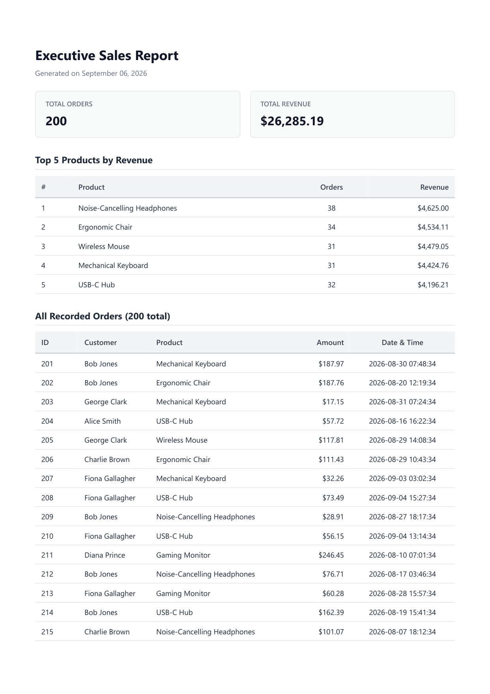

# PDF Report Generator (Week 7 · Assignment A8)

An end-to-end automated data reporting pipeline built with **Python**, **FastAPI**, **SQLite**, and **Playwright**.

The pipeline executes a classic SaaS reporting workflow:
**Query** (SQL aggregations) &rarr; **Render** (HTML template with print CSS to headless Chromium) &rarr; **Store** (PDF artifact on disk) &rarr; **Serve** (link-based download via `FileResponse`).

---

## 1. What This Is

This service aggregates business transaction data from a SQLite database, compiles the metrics into a styled executive HTML report, converts the HTML into an A4 PDF document using headless Chromium via Playwright, and serves the document via REST API endpoints following the "store and link" architectural pattern.

### Key Features
- **Deterministic SQL Aggregations:** Analyzes totals, high-performing products, and daily order volumes.
- **Clean Print CSS:** Enforces `thead { display: table-header-group; }` to repeat table headers across pages and `tr { break-inside: avoid; }` to prevent table row splitting across page breaks.
- **Store & Link Pattern:** API JSON responses remain lightweight by passing artifact URLs (`/reports/<id>/file`); file bytes are only transferred when the artifact is requested.
- **Idempotency (Stage 5):** Duplicate generation requests within the same day return the existing report (HTTP 200) instead of rerunning browser generation. Passing `{"force": true}` bypasses the check to create a fresh report (HTTP 201).

---

## 2. Dataset Chosen

**Option A — The Little Shop Dataset**
- Table: `orders` (`id`, `customer`, `product`, `amount`, `created_at`).
- Seed size: 200 orders distributed across 6 product categories over the last 30 days.
- Safe to re-run: `seed.py` wipes previous rows before inserting, ensuring idempotent seeding.

---

## 3. How to Run

### 1. Install Dependencies
```powershell
pip install -r requirements.txt
playwright install chromium
```

### 2. Seed Database
```powershell
python seed.py
```
*Output: `Seeded report.db. Total orders count: 200`*

### 3. Run FastAPI Server
```powershell
uvicorn main:app --reload --port 8000
```

### 4. Health Check
```powershell
curl -i http://localhost:8000/health
```

---

## 4. SQL Aggregation Queries

The report relies on four core aggregations implemented in `report.py`:

```sql
-- 1. Total number of orders
SELECT COUNT(*) FROM orders;

-- 2. Total revenue
SELECT ROUND(COALESCE(SUM(amount), 0), 2) FROM orders;

-- 3. Top 5 products by revenue
SELECT product, ROUND(SUM(amount), 2) AS revenue, COUNT(*) AS count
FROM orders
GROUP BY product
ORDER BY revenue DESC
LIMIT 5;

-- 4. Orders per day for the last 7 days
SELECT date(created_at) AS order_date, COUNT(*) AS count, ROUND(SUM(amount), 2) AS revenue
FROM orders
GROUP BY date(created_at)
ORDER BY order_date DESC
LIMIT 7;
```

---

## 5. POST &rarr; Download Terminal Proof

### Step 1: Generate Report (POST `/reports`)
```powershell
curl -i -X POST http://localhost:8000/reports
```
```http
HTTP/1.1 201 Created
content-type: application/json

{"id":1,"file":"/reports/1/file"}
```

### Step 2: Idempotent Duplicate Request (Double-click test)
```powershell
curl -i -X POST http://localhost:8000/reports
```
```http
HTTP/1.1 200 OK
content-type: application/json

{"id":1,"file":"/reports/1/file"}
```

### Step 3: Fetch Report Metadata (GET `/reports/1`)
```powershell
curl -i http://localhost:8000/reports/1
```
```http
HTTP/1.1 200 OK
content-type: application/json

{"id":1,"path":"reports/1.pdf","created_at":"2026-09-06 14:58:21","file":"/reports/1/file"}
```

### Step 4: Download PDF File (GET `/reports/1/file`)
```powershell
curl -o sales-report.pdf http://localhost:8000/reports/1/file
```
```
  % Total    % Received % Xferd  Average Speed   Time    Time     Time  Current
                                 Dload  Upload   Total   Spent    Left  Speed
100 59840  100 59840    0     0  1450k      0 --:--:-- --:--:-- --:--:-- 1450k
```

---

## 6. Stage 4 & Stage 5 Analysis

### Stage 4: Background Jobs Transition
> **Question:** *At what point would you move this work out of the request?*
> 
> **Answer:** I would move PDF generation out of the HTTP request into an asynchronous background queue (e.g., using Celery, RQ, or Inngest) as soon as rendering duration regularly exceeds ~500ms–1s, involves querying hundreds of thousands of rows, or serves multiple concurrent users where blocking synchronous request workers risks HTTP timeouts and degrades overall API responsiveness.

### Stage 5: Idempotency Protection
> **Question:** *What does your check protect against, and one real-world example where a missing check like this costs money?*
> 
> **Answer:** Our check protects against duplicate report generation triggered by user double-clicks or automated network retries, avoiding unnecessary headless browser CPU cycles, database strain, and redundant disk usage. In a real-world system where reports trigger paid third-party APIs (such as credit bureau lookups) or initiate transactional billing emails, missing idempotency would cause customers to be billed twice or receive duplicate invoices, directly causing chargebacks, support overhead, and financial loss.

---

## 7. Generated PDF Preview

Below is page 1 of the multi-page PDF document generated by Playwright headless Chromium:



